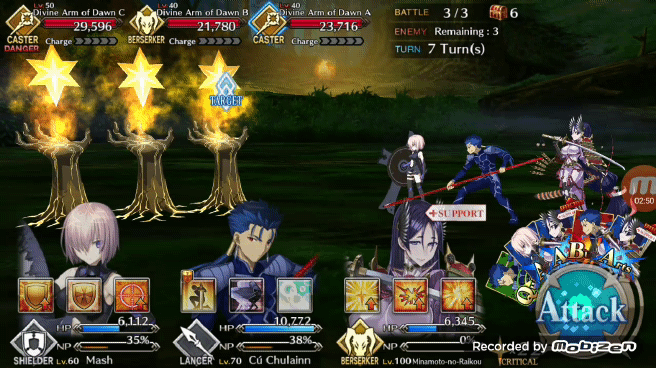

# Project Pendragon

Project Pendragon uses a backbone of three Pytorch neural networks to make decisions on what cards to play and when within the mobile phone game Fate Grand Order (FGO). For some this might be me overengineering a solution, but for me is a fun project that actually does save me time daily with in-game item farming. It frees up 10-15 minutes per morning that I would have spent farming which is quite useful before work.

Before starting coding, I had to figure out the general process I wanted the bot to follow and the following is the logic structure I came up with.

-upon starting, it looks to see if it can see the "attack" button, if it finds it it presses it and moves into the phase of the turn where it picks 3 of the 5 command cards

-The bot goes through and checks to see if there are 3 cards by the same character out of the 5 cards. If so then it creates that "brave chain"

-If no brave chain is found, then it will look at all the cards, check their types and look for 3 cards of the same type to create a card chain.

-if no card chains are found. Then it will play available in the following order of priority. Arts cards, buster cards, and quick cards. (I tend to prioritize arts cards in my play, because they charge ultimate abilities for the characters called "Noble Phantasms" in FGO, so I just had the bot do this) This is also the order that the bot will try to play cards in for the different chains for the same reason. 
Once that is done it will start checking for the reappearance of the attack button and the bot's turn will start again.

So in this process the ability to identify the attack button and the card types are traditional CNNs while looking for 3 cards by the same character is a siamese CNN. 
I built all of the networks using Pytorch and trained them on either a 1060 or 1080 Nvidia GPU.

For more detail here is a link to the medium post (here)

Useful files:
project_pendragon.py is the main bot file
3 model training files: resnet34_pytorch.py, resnet18_pytorch.py, and the siamese network I actually trained in a jupyter notebook which I also included. 

the utils file contains helper functions that I call in project_pendragon.py to make it more readable and the grab screen file was there to help me calibrate the screen captures and crops that I would use for inputs into my various networks for the bot. 

